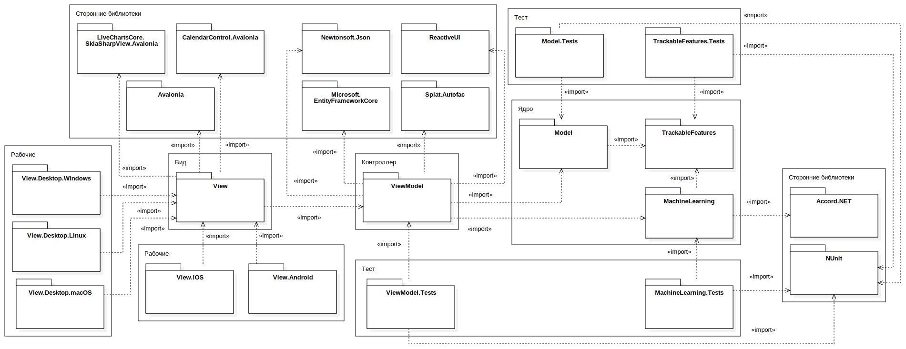
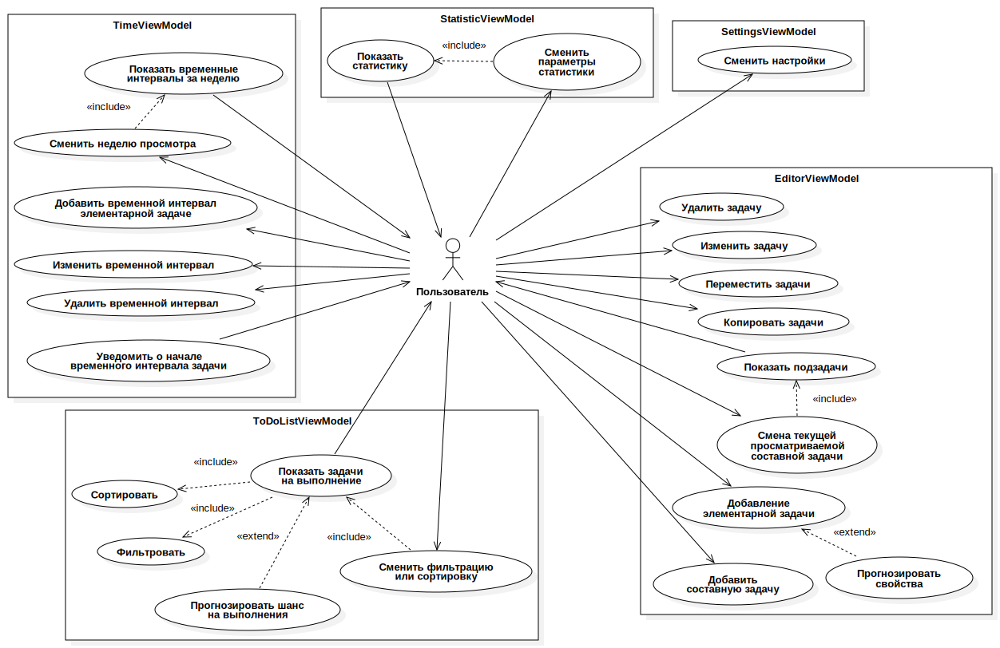
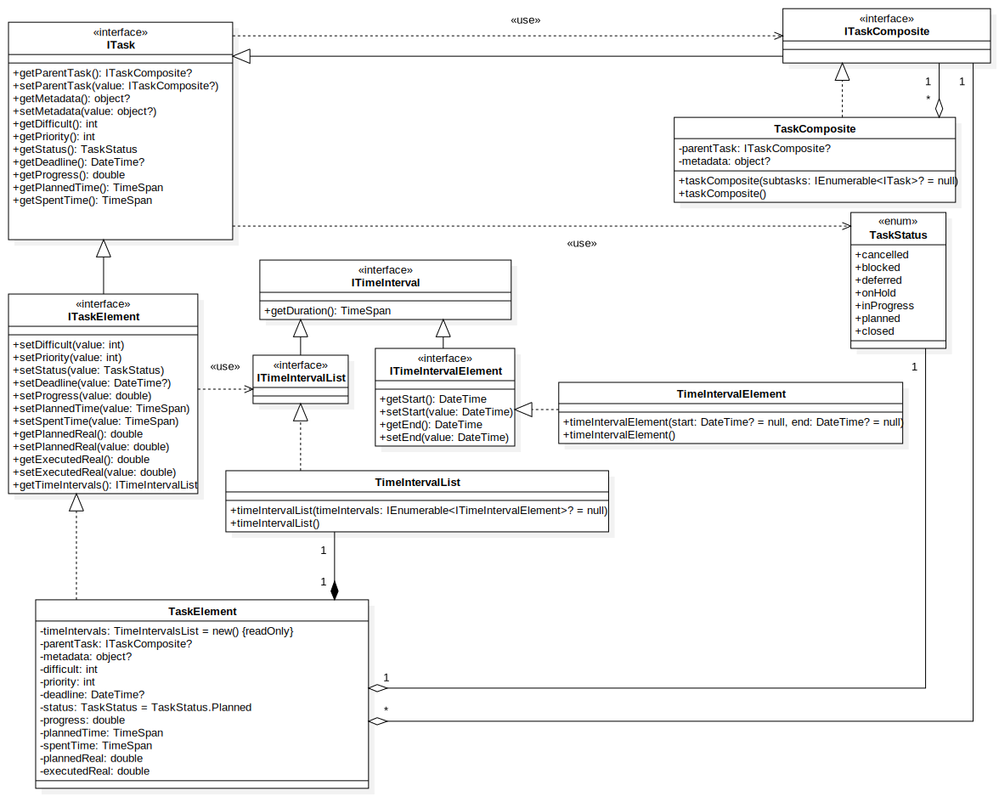
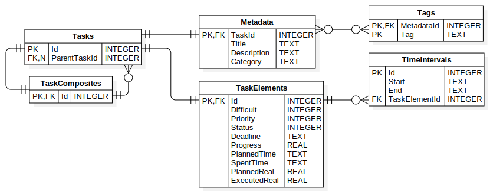
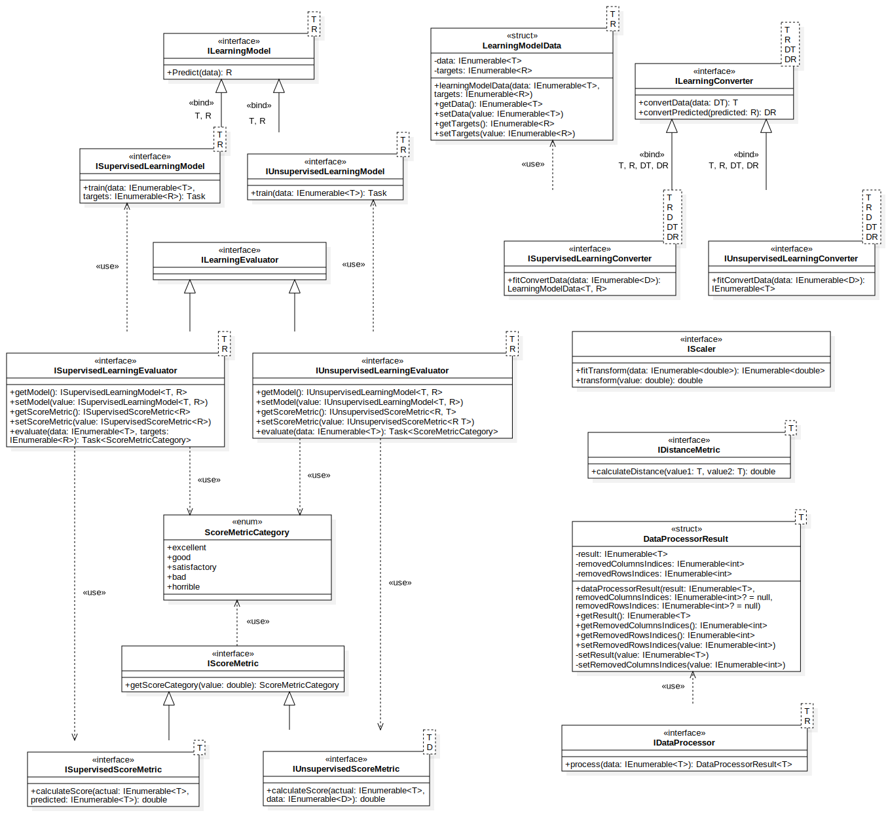

# TaskManager

**TaskManager** — это приложение для управления задачами.

## Содержание

- [Структура репозитория](#структура-репозитория)
- [Функционал](#функционал)
- [Набор технологий](#набор-технологий)
  - [Основной набор технологий](#основной-набор-технологий)
  - [Дополнительный набор технологий](#дополнительный-набор-технологий)
- [Установка и запуск](#установка-и-запуск)
  - [Требования](#требования)
  - [Пример работы](#пример-работы)
  - [Запуск](#запуск)
- [Поддержка кода](#поддержка-кода)
  - [Разработка](#разработка)
  - [Тестирование](#тестирование)
- [Контакты](#контакты)

## Структура репозитория

Структура репозитория такая:

- [docs](docs/) - документация
  - [api](docs/api/) - документация API
    - [diagrams](docs/api/diagrams/) - диаграммы
  - [screenshots](docs/screenshots/) - скриншоты
  - [reports](docs/reports/) - отчёты
- [src](src/) - исходный код
- [tests](tests/) - тесты
- [build](build/) - сборки

## Функционал

Приложение предоставляет следующий функционал:

- **Управление задачами**: хранение данных (приоритет, сложность, статус, прогресс, статус, сроки, время, реальные показатели, метаданные), создание, редактирование, удаление, управление иерархией, планирование в календаре.
- **Статистика**: анализ задач по категориям, тегам, сложности, приоритету, времени и срокам.
- **Анализ**: ранжирование задач, выявление отстающих.
- **Прогнозирование**: оценка времени, реального показателя, срока, вероятности выполнения в срок.
- **Уведомления**: напоминания о запланированном времени выполнения.

## Набор технологий

### Основной набор технологий

Основным набором технологий для проекта является:

- Платформа разработки [.NET](https://dotnet.microsoft.com/) и язык программирования [C#](https://learn.microsoft.com/dotnet/csharp/)
- Фреймворк для построения реактивных пользовательских интерфейсов [ReactiveUI](https://www.reactiveui.net/)
- Фреймфорк [Avalonia](https://avaloniaui.net/) для создания кроссплатформенного пользовательского интерфейса
- База данных [SQLite](https://www.sqlite.org/) для локального хранения данных
- ORM-фреймворк [Entity Framework Core](https://learn.microsoft.com/ef/core/) для работы с базами данных
- Платформа машинного обучения [Accord\.NET](http://accord-framework.net/)
- Библиотека для модульного тестирования [NUnit](https://nunit.org/)

### Дополнительный набор технологий

Дополнительно были выбраны следующие технологии:

- Дополнение [Autofac](https://www.nuget.org/packages/Splat.Autofac/) для библиотеки [Splat](https://github.com/reactiveui/splat), предоставляющее интеграцию с IoC-контейнером
- Библиотека для работы с JSON [Newtonsoft.Json](https://www.newtonsoft.com/json)
- Библиотека для построения интерактивных графиков и диаграмм [LiveCharts](https://livecharts.dev/)
- Пользовательская реализация элемента управления Avalonia для работы с календарём [CalendarControl.Avalonia](https://github.com/satial-interfaces/CalendarControl)

## Установка и запуск

### Требования

Требования для запуска:

1. Поддерживаемые операционные системы:
   - Windows 10+
   - Android 5.0+ (API 21)
   - Linux-дистрибутивы (Debian 9+, Ubuntu 16.04+, Fedora 30+)
   - macOS 10.14+
   - iOS 13.0+
2. Необходимая установленная платформа - .NET 8+

### Пример работы

Пример работы приложения:

- Страница редактирования задач:
  
- Страница календаря:
  
- Страница статистики:
  
- Страница списка задач для выполнения:
  
- Страница настройки:
  

Другие примеры расположены в папке [docs/screenshots](docs/screenshots/).

### Запуск

В проекте есть скомпилированные сборки в архивах находящиеся в папке [build](build/).

Для самостоятельного запуска выполните команды для:

1. компиляции проекты:

```
dotnet build --source {path to source}
```

2. запуска проект:

```
dotnet run {path to project}
```

## Поддержка кода

### Разработка

Исходный код располагается в папке [src](src/).

Документация API находится в папке [docs/api](docs/api/). Так же были созданы UML-диаграммы (и не только), которые находятся в [docs/api/diagrams](docs/api/diagrams/).

Основные диаграммы:

- Диаграмма пакетов:
  
- Диаграмма сценариев использования:
  
- Диаграмма классов предметной области:
  
- Диаграмма связи сущностей базы данных:
  
- Диаграмма классов машинного обучения:
  

### Тестирование

В проекте реализованы модульные тесты с использованием NUnit в папке [tests](tests/).

Для запуска тестов выполните команду:

```
dotnet test {path to tests}
```

Итоги тестирования представлены в документах:

- [Отчёт по выполенению тестов](docs/reports/TestExecutionReport.pdf)
- [Отчёт по покрытию кода тестами](docs/reports/TestCoverageReport.pdf)

## Контакты

- [Репозиторий](https://github.com/FolderMaster/TaskManagerApp)
- [GitHub](https://github.com/FolderMaster)
